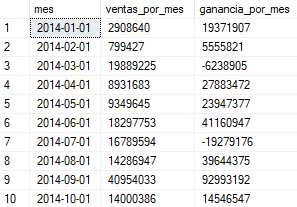
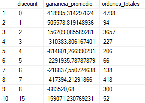
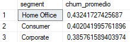
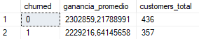
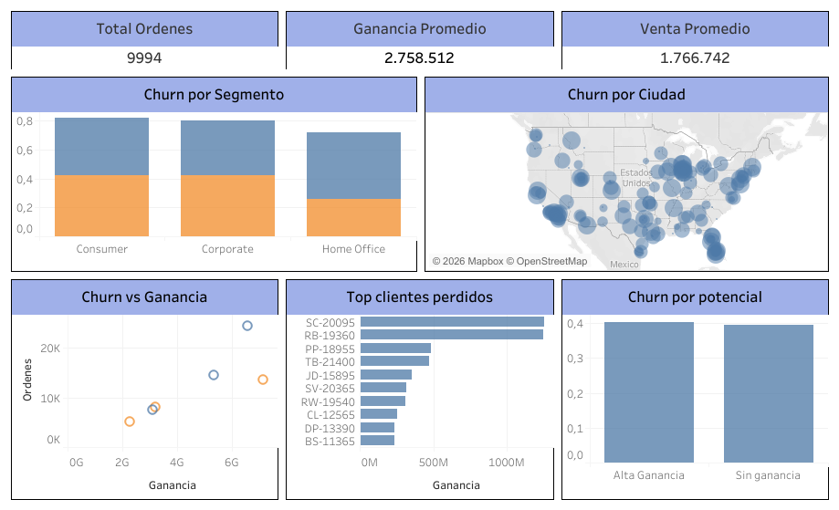

# Análisis de Churn y Rentabilidad de Clientes

- SQL Server
- Tableau
- Data Analytics


## Resumen del Proyecto

Este proyecto analiza el churn de clientes utilizando datos transaccionales del dataset Superstore.
El foco no está únicamente en medir cuántos clientes se pierden, sino en entender qué tipo de clientes se pierden y cuál es el impacto en la rentabilidad del negocio.

El análisis se realiza en SQL Server, donde se construyen las métricas clave, y luego se exportan SQL VIEWS para visualización en Tableau.


## Objetivos del Análisis

- Analizar ventas y ganancias a nivel global, temporal y por producto
- Medir churn de clientes a partir de inactividad (90 dias)
- Relacionar churn con rentabilidad del cliente
- Identificar churn económicamente riesgoso
- Generar datasets listos para visualización en Tableau


## Modelado de Datos en SQL

A partir de la tabla cruda superstore_raw, se normalizaron los datos en tres tablas principales:

### orders

Contiene la información transaccional de cada orden:

- fechas
- ventas (sales)
- ganancias (profit)
- descuentos
- productos
- clientes


### products

Contiene información descriptiva del producto:

- categoría
- subcategoría
- nombre del producto


### customers

Contiene información del cliente:

- nombre
- segmento
- ciudad
- país


## Exploratory Data Analysis (EDA) en SQL

### Evolución temporal

``` sql
SELECT 
  DATEFROMPARTS(YEAR(order_date), MONTH(order_date), 1) AS mes,
  SUM(sales) AS ventas_por_mes,
  SUM(profit) AS ganancia_por_mes
FROM orders
GROUP BY DATEFROMPARTS(YEAR(order_date), MONTH(order_date), 1)
ORDER BY mes;
```

Se analiza la evolución mensual de ventas y ganancias para observar si existe estacionalidad o periodos de caida/crecimiento

<p align="center">
  
</p>


### Descuentos y rentabilidad

``` sql
SELECT
  discount,
  AVG(profit) AS ganancia_promedio
FROM orders
GROUP BY discount
HAVING AVG(profit) < 0;
```

Se observa como los descuentos impactan en las ganancias

<p align="center">
  
</p>


Se concluye que ciertos niveles de descuento generan pérdidas y que más ventas no implican mayor rentabilidad


### Definición de Churn

El churn se define como inactividad del cliente

Un cliente se considera churned si su última compra ocurrió más de 90 días antes de la fecha máxima del dataset


``` sql
CREATE VIEW view_churn AS 
WITH ultima_actividad AS (
  SELECT 
    customer_id,
    MAX(order_date) AS fecha_ultima_orden
  FROM orders
  GROUP BY customer_id
)
SELECT
  customer_id,
  fecha_ultima_orden,
  CASE
    WHEN fecha_ultima_orden < DATEADD(day, -90, (SELECT MAX(order_date) FROM orders))
    THEN 1
    ELSE 0
  END AS churned
FROM ultima_actividad;
```


- churned = 1 → Cliente inactivo
- churned = 0 → Cliente activo


### Churn por Segmento y Región


``` sql
SELECT
  c.segment,
  AVG(CAST(churned AS FLOAT)) AS churn_promedio
FROM view_churn vch
JOIN customers c ON c.customer_id = vch.customer_id
GROUP BY c.segment;
```

<p align="center">
  
</p>


Se observa que el segmento home office es el de mayor churn


### Churn vs Rentabilidad

``` sql
SELECT 
  ch.churned,
  AVG(gc.ganancias_totales) AS ganancia_promedio,
  COUNT(*) AS customers_total
FROM view_churn ch
JOIN view_ganancia_consumidor gc 
  ON ch.customer_id = gc.customer_id
GROUP BY ch.churned;
```


<p align="center">
  
</p>


Se observa una gran perdida de clientes con una ganancia promedio significativa


### Vistas Finales


``` sql
CREATE VIEW view_analisis_churn AS
SELECT
  c.customer_id,
  c.segment,
  c.city,
  ch.churned,
  gc.ganancias_totales,
  gc.ventas_totales,
  gc.ordenes_totales,
  CASE
    WHEN gc.ganancias_totales < 0 THEN 'Sin ganancia'
    WHEN gc.ganancias_totales BETWEEN 0 AND 500 THEN 'Poca ganancia'
    ELSE 'Alta Ganancia'
  END AS ganancia
FROM customers c
LEFT JOIN view_churn ch ON c.customer_id = ch.customer_id
LEFT JOIN view_ganancia_consumidor gc ON c.customer_id = gc.customer_id;
```


## Visualización en Tableau

<p align="center">
  
</p>

- KPIs de ordenes, sales y ganancias
- churn por segmento
- churn vs ganancia total
- identificación de churn riesgoso


Se exploran diferencias por segmento y ciudad que permite identificar lod grupos de clientes que son mas propensos a dejar de comprar. A traves de un análisis entre rentabilidad y churn, se distinguen perdidas de clientes que representan poco valor y pérdidas de clientes que generan ganancias. Se observan clientes de alta rentabilidad que churnearon, lo cual representa un riesgo grande. Por lo tanto, no todo churn es perjudicial y esta metrica por si sola no es indicadora de riesgo.


Link al Dashboard: https://public.tableau.com/views/Sales_Churn_Analysis_Dashboard/Dashboard?:language=es-ES&:sid=&:redirect=auth&:display_count=n&:origin=viz_share_link


## Conclusiones

El churn por si mismo no es una metrica de riesgo. El riesgo está en perder clientes que generan valor, es decir, clientes de alto impacto que churnean. 


## Posibles medidas a tomar

- Priorizar retención de clientes de alta ganancia
- Reducir esfuerzos sobre churn de bajo valor
- Analizar políticas de descuento (Del EDA se observa que algunos descuentos generan ganacias negativas)
- Diseñar estrategias diferenciadas por segmento y región
